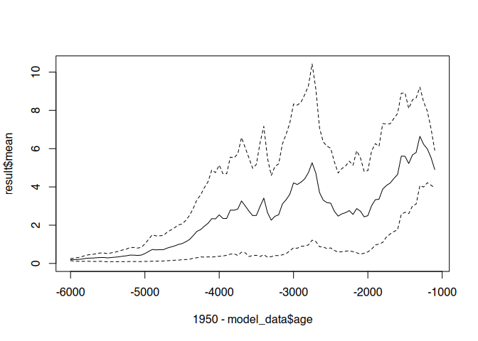
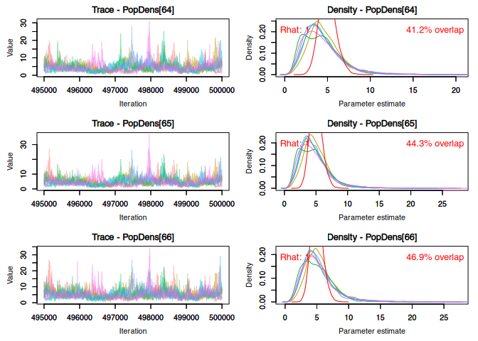

## Preface

In the review of the article, the model and the associated analysis, it was noted that the model we use is too constrained by the Poisson process. We are convinced that the Poisson process is the right choice to model a settlement number as a process autocorrelated over time. Nevertheless, we are happy to modify the model accordingly to show the differences. This document contains the corresponding alternative version of the model and its results.

As with the original model: Running through the analysis can take a long time, especially the Bayesian model. We point out the long runtimes again at the appropriate place. Also, you might need at least 64 GB of RAM to avoid crashes due to missing memory.

## Loading the necessary libraries

For this analysis we need the following libraries:


```r
library(tidyverse)
library(ggdist)
library(reshape2)
library(here)
#library(RcppRoll)
#library(sf)
#library(mapview)
#library(vegan)
#library(neotoma)
#library(analogue)
#library(rcarbon)
library(doParallel)
library(nimble)
library(coda)
library(MCMCvis)
library(fmcmc)
library(grid)
```

If you have not yet installed these libraries (and receive a corresponding error message), please install them!

## Loading and transforming the preprocessed data

First we load the pre-processed data:


```r
all_proxies <- read.csv(file = normalizePath(
  file.path(here(), "data","preprocessed_data", "all_proxies.csv")
  ),
  row.names = 1)
```

Then we carry out the transformation steps as we did in the actual analysis.

First we reverse the order of the data so that it is sorted from oldest to youngest:


```r
all_proxies <- all_proxies %>% arrange(desc(age))
```

Since the data influence the model in their respective change from the state t -\> t-1, we first normalise them by a z-transformation, and then calculate the individual difference to the predecessor. The first row is set to 0.


```r
all_proxies[,2:5] <- all_proxies[,2:5] %>% scale() %>% diff() %>% rbind(0,.)
```

Furthermore, it has proven practical, at least in the development phase of the model, to be able to restrict the data set in order to quickly try out responses of the model. Each data point is included in the model as a separate parameter, and it therefore does not scale linearly with the number of data points. It can also be helpful for reproducing the analysis. To do this, we define a reduction factor that determines what proportion of the data is passed to the model and reduce the data set accordingly.


```r
redux_factor <- 1
redux_nrow <- round(nrow(all_proxies) * redux_factor)
redux_seq <- round(seq(from=1,to=nrow(all_proxies), length.out = redux_nrow))

model_data <- all_proxies[redux_seq,]
```

Furthermore, the model contains two constraints for the maximum growth rate. These help to speed up convergence. They are given as data and must be set to 1 for the constraint to be processed.


```r
model_data$constraint_lambda_lower <- 1
model_data$constraint_lambda_upper <- 1
```

## The Model

The actual model consists of a nimble code block that describes the relationships and sets the priors for the parameters. It should be noted that we have changed the function for the number of settlements, and thus the proposal distribution. It is now a Negative Binomial Distribution, where both the expected value and the variance can vary. The expected value is still derived from $\lambda_t$, but this is integrated into the model via a success parameter $prob_t$, which results as follows:

$$
prob_t = \frac{r}{r+\lambda_t}
$$

The parameter $r$ used here and also in the distribution itself is the one that determines the overdispersion and thus makes the variance variable compared to a Poisson distribution. If this parameter approaches infinity, the Negative Binomial Distribution approaches a Poisson distribution. In practice, values above 30 lead to convergence. $r$ is estimated in the model itself.


```r
model_code <- nimbleCode( {
  # ---- Process Model ----
  
  # Estimate the initial state vector of population abundances
  nEnd ~ dnorm(nSites[nYears] * MeanSiteSize / AreaSwissPlateau, sd=0.5)

  # Autoregressive process for remaining years
  for(t in 2:(nYears)) {
    # The actual number of sites per year
    nSites[t] ~ dnegbin(prob[t],r)
    prob[t] <- r/(r+lambda[t]) 

    # limiting the change to a maximum value, estimated in the model
    constraint_lambda_lower[t] ~ dconstraint(
      nSites[t]/nSites[t-1] < (max_growth_rate + 1)
      )
    constraint_lambda_upper[t] ~ dconstraint(
      nSites[t-1]/nSites[t] < (max_growth_rate + 1)
      )
  }
  
  #r ~ dunif(0,10000)
  #r ~ dgamma(0.5,0.5)
  #r ~ dlnorm(6,1)
  r.cauchy ~ dt(mu = 0, sigma = 5, df = 1)
  r <- abs(r.cauchy)

  
  # ---- Observational Model ----

  # For all but the first year
  for(t in 2:(nYears)) {
    # lambda depends on the number of sites at the previous year, plus
    # changes in relation to the proxies
    log(lambda[t]) <- log(nSites[t-1]) + (
      p[1] * sumcal[t]  +
        p[2] * openness[t] +
        p[3] * aoristic_sum[t] + 
        p[4] * dendro[t]
      )
  }
  # ---- Priors ----
  # Relevance of the proxies is estimated as Dirichlet distribution
  p[1:4] ~ ddirch(alpha[1:4])
  
  # The parameters for the Dirichlet distribution have a weakly informative prior
  for(j in 1:4) {
    alpha[j] ~ dlnorm(mu_alpha[j],sdlog=a_alpha[j])
    a_alpha[j] ~ dexp(1)
    mu_alpha[j] ~ dlnorm(1,sdlog=0.1)
  }
  
  # The maximum growth rate has a prior gamma distributed between 0 and 1
  # by adding 1 in the process model, this becomes 1-2[
  max_growth_rate ~ dgamma(shape = 5, scale=0.05)

  # The mean site size
  MeanSiteSize ~ dpois(50)
    
  # ---- transformed data ----
  
  # Population density and total population as function of site number
  PopDens[1:(nYears)] <- PopTotal[1:(nYears)] / AreaSwissPlateau
  PopTotal[1:nYears] <- nSites[1:nYears] * MeanSiteSize
})
```

## Run Preparation

A few things still need to be specified for the model: constants and initial values. Let's start with the constants:


```r
model_constants <- list(
  # an estimation for the population density at the end of the modeled period
  nEnd = 5, 
  # the number of time slices
  nYears = redux_nrow,
  # the area of the swiss plateau for the transformation
  # of population density to Total Population
  AreaSwissPlateau = 12649
  )
```

Finally, it helps for convergence to give meaningful starting values for the chains:


```r
# Calculation of an exponential increase of the factor 10
r <- log(1 - (10^(1/model_constants$nYears) - 1))
model_inits <- list(
  lambda = rep(r,redux_nrow),
  PopDens = rep(model_constants$nEnd,redux_nrow),
  nSites = rep(50,redux_nrow)
)
```

Furthermore, we set the parameters for the runs until convergence:


```r
batches <- 100000 # run in batches of this length
thinning <- 10 # save only each ... of the chains
```

Finally, we have to define which parameters (apart from the top-level stochastic nodes of the model) are to be observed and stored. We also include the population density as a core parameter and the relative proportion of proxies p:


```r
model_monitors <- c("PopDens", "p", "r")
```

## Parallelisation

The model runs significantly faster if we use multiple cores in parallel. Nimble itself does not have an option for parallelisation, so we use functions provided by the package `do_parallel` for this. The computer used for the analysis has 4 cores, you may need to adjust these values for your computer.


```r
# Spare 2 cores from the calculation
ncore <- detectCores() - 2
ncore <- max(ncore, 1)

# Register the cluster
cl <- makeCluster(ncore)
registerDoParallel(cl)

# Export common values for the cluster
clusterExport(cl,
              c("model_code",
                "model_inits",
                "model_data",
                "model_constants",
                "model_monitors",
                "batches",
                "thinning"
                )
              )

# Set random seeds
for (j in seq_along(cl)) {
  set.seed(j)
}
```

## First batch

In the first run, the clusters are set up and the models are instantiated and started within the clusters.


```r
start_time <- Sys.time()

mcmcSamples <- clusterEvalQ(cl, {
  
  # Load necessary libraries
  library(nimble)
  library(coda)
  
  # initiate the model with the parameters and dates
  model <- nimbleModel(code=model_code,
                       data=model_data,
                       constants = model_constants,
                       inits = model_inits)
  
  # Compile the model
  Cmodel <- compileNimble(model)
  
  # Configure the model
  modelConf <- configureMCMC(model, thin = thinning)
  
  # Add the monitor(s)
  modelConf$addMonitors(model_monitors)
  
  # Build the mcmc
  modelMCMC <- buildMCMC(modelConf)
  
  # Compile the final model
  CmodelMCMC <- compileNimble(modelMCMC, project = model)
  
  # Run the model for the number of iterations specified in batches
  CmodelMCMC$run(batches, reset = FALSE)
  return(as.mcmc(as.matrix(CmodelMCMC$mvSamples)))
})


end_time <- Sys.time()
end_time - start_time
```

```
## Time difference of 2.21428 mins
```

At the end of the 1st run, the model is instantiated in the individual cluster partitions, possibly already converged. But we now check the convergence in continued runs.


```r
# Initialize with non-convergence
converged <- F
progress <- data.frame(tick = vector(),
                        mean_psrf = vector(),
                        max_psrf = vector())
tick <- 1

# minimum psrf until the model is considered converged
min_convergence <- 1.1

start_time <- Sys.time()

# As long as not converged
while (!converged) {
  
  tick <- tick + 1
  # run the model for another batch, with resetting the values (burn-in)
  mcmcSamples <- clusterEvalQ(cl, {
    CmodelMCMC$run(batches, reset = FALSE, resetMV = TRUE)
    return(as.mcmc(as.matrix(CmodelMCMC$mvSamples)))
  })

  # convert the resulting list to an mcmc.list object
  mcmcSamples <- as.mcmc.list(mcmcSamples)

  # Check the psrf values from the Gelman and Rubin's convergence diagnostic
  gelman <- gelman.diag(mcmcSamples, multivariate = F)
  psrf <- gelman$psrf[,1]

  # The model is considered converged when
  # all psrf are lower than the minimum convergence criterion
  converged <- all(psrf<min_convergence, na.rm=T)

  progress <- rbind(progress,
                     data.frame(tick = tick,
                        mean_psrf = mean(psrf),
                        max_psrf = max(psrf)))
  # optional: create an mcmc traceplot for visual inspection
  #MCMCtrace(window(mcmcSamples, start = (batches/thinning)-min((batches/thinning),5000)), params = "PopDens", pdf = F)
}

end_time <- Sys.time()
end_time - start_time
```

```
## Time difference of 3.92654 mins
```

Once the model has converged, we can look at the result of estimating the population density based on the number of settlements. For this we extract the mean and 95% highest posterior density interval:


```r
result <- MCMCsummary(mcmcSamples, HPD = T, params = "PopDens")

plotmax <- max(result$`95%_HPDU`)

plot(1950-model_data$age, result$mean, type="l", ylim = c(0,plotmax))
lines(1950-model_data$age, result$`95%_HPDL`, lty=2)
lines(1950-model_data$age, result$`95%_HPDU`, lty=2)
```

<!-- -->

It is already clear here that the basic structure and the (mean) values of the estimation do not differ significantly from the Poisson model. As expected, the credibility intervals are larger because an additional degree of freedom has been introduced by the free variance.

This converged run is sufficient to check some initial parameter values. For example, we can see how the proportional importance of the proxies is distributed:


```r
MCMCchains(mcmcSamples, params = "p") %>%
  as.data.frame %>%
  rename(sumcal = 'p[1]', openness = 'p[2]', aorist = 'p[3]', dendro = 'p[4]') %>%
  pivot_longer(everything()) %>%
  ggplot(aes(x = value, y = name)) + stat_halfeye()
```

<!-- -->

The model still trusts mainly the openness index, the aoristic sum and the dendro data play a subordinate role. The sum calibration has a higher weight.

Der Parameter für die Überdispersion $r$ ist ja auch im Modell geschätzt worden. Folgende Graphik gibt seine Verteilung wieder:


```r
MCMCchains(mcmcSamples, params = "r") %>%
  as.data.frame %>%
  pivot_longer(everything()) %>%
  ggplot(aes(x = value, y = name)) + stat_halfeye() + xlim(0,1000)
```

```
## Warning: Removed 7508 rows containing missing values (stat_slabinterval).
```

<!-- -->

Let's take a look at the effective samples:


```r
MCMCsummary(mcmcSamples) %>%
  as.data.frame() %>%
  rownames_to_column() %>%
  ggplot() + geom_bar(aes(y=n.eff, x=rowname), stat = "identity") + coord_flip()
```

<!-- -->

Very few parameters have already reached the effective sample size of 10000 suggested for a reliable estimate. Therefore, we extend the run until this number is reached.

## Finale Run after Convergence

The final run after convergence to get more than the min 10000 effective samples for each parameter takes quite some time. On my machine, it took nearly 5 hours. Therefore, I add a switch here for not doing this analysis, but feel free to proceed yourself, if you like:


```r
do_final_run = F
```

First we set our new meta-parameters:


```r
# Starting with not enough samples
enough_samples <- F

# We want at least 10000 effective samples
min_eff_samples <- 10000

# We prolongue the batches for more time efficient sampling
sample_batches <- 1000000
```

Then we export the new batch length to the clusters:


```r
clusterExport(cl, c("sample_batches"))
```

In order to work memory-efficiently (the model can need a lot of memory quickly!), we only allow the current samples to be used within the cluster instances and collect them outside the clusters in a variable:


```r
start_time <- Sys.time()
while (!enough_samples & do_final_run) {
  
  gc(verbose=F) # Garbage collector for more RAM

  # Start sampling  
  mcmcSamples <- clusterEvalQ(cl, {
    CmodelMCMC$run(sample_batches, reset = FALSE, resetMV = TRUE)
    return(as.mcmc(as.matrix(CmodelMCMC$mvSamples)))
  })
  
  mcmcSamples <- as.mcmc.list(mcmcSamples)
  
  # create or append values to a collector variable
  if(!exists("collector")){
    collector <- mcmcSamples
  } else {
    collector <- append_chains(collector, mcmcSamples)
  }
  
  # calculate effective sample size iteratively over the chains
  # and then sum the individual values
  # more RAM efficient than the `MCMCsummary` implementation
  mcmcsummary <- lapply(collector, effectiveSize)
  ness <- Reduce(`+`, mcmcsummary)
  
  ness <- ness[!(names(ness) %in% c("r", "r.cauchy")) ] 
  
  # we have enough samples, when all parameters have more than the minimum ESS
  enough_samples <- all(ness >  min_eff_samples)

  # just in case: store the result in a RDS file for later inspection  
  saveRDS(collector, file = normalizePath(
  file.path(here(), "data","result_data", "mcmc_collector_neg_binomial.RDS"), mustWork = F
  ))
}

end_time <- Sys.time()
end_time - start_time
```

```
## Time difference of 0.01919985 secs
```

Please note that I excluded 'r' and 'r.cauchy' from the list of parameters that need at least 10000 effective samples. Having that in prolongues the calculation by a factor of 4, which might not be necessary in this context.

When the model has finished running, we should stop the clusters:


```r
stopCluster(cl)
```

If the final run above was skipped, but you have already the results from a previous run, you can load this at this stage:


```r
collector <- readRDS(file = normalizePath(
  file.path(here(), "data","result_data", "mcmc_collector_neg_binomial.RDS")
  ))
```


For comparison with the priors, we simulate from these, first for p:


```r
n_prior <- 100000
a_alpha <- mu_alpha <- alpha <- list()

for(j in 1:4) {
a_alpha[[j]] <- rexp(n_prior, 1)
mu_alpha[[j]] <- rlnorm(n_prior, 1,sdlog=0.1)
alpha[[j]] <- rlnorm(n_prior, mu_alpha[[j]],sdlog=a_alpha[[j]])
}

p_mat <- matrix(ncol = 4, nrow = n_prior)
for(i in 1:n_prior){
 p_mat[i,] <- rdirch(1, c(alpha[[1]][i], alpha[[2]][i], alpha[[3]][i], alpha[[4]][i]))
}
MCMCtrace(collector, params = "p", priors = p_mat, pdf = F, ind = T, Rhat = T)
```

```
## Warning in MCMCtrace(collector, params = "p", priors = p_mat, pdf = F, ind =
## T, : Number of samples in prior is greater than number of total or specified
## iterations (for all chains) for specified parameter. Only last 30000 iterations
## will be used.
```

<!-- --><!-- -->

And then for lambda and nSites (respectively derived for PopDens):


```r
nSites <- matrix(ncol = model_constants$nYears, nrow = n_prior)
MeanSiteSize <- rpois(n_prior, 50)

nEnd <- rnorm(n_prior, model_constants$nEnd, sd=0.5)

nSites[,model_constants$nYears] <- rpois(n_prior,nEnd / MeanSiteSize * model_constants$AreaSwissPlateau)

for(i in (model_constants$nYears-1):1) {
  nSites[,i] <- rpois(n_prior, nSites[,i+1])
}

PopDens <- nSites * MeanSiteSize / model_constants$AreaSwissPlateau

MCMCtrace(collector, params = "PopDens", priors = PopDens, pdf = F, ind = T, Rhat = T)
```

```
## Warning in MCMCtrace(collector, params = "PopDens", priors = PopDens, pdf =
## F, : Number of samples in prior is greater than number of total or specified
## iterations (for all chains) for specified parameter. Only last 30000 iterations
## will be used.
```

<!-- --><!-- --><!-- --><!-- --><!-- --><!-- --><!-- --><!-- --><!-- --><!-- --><!-- --><!-- --><!-- --><!-- --><!-- --><!-- --><!-- --><!-- --><!-- --><!-- --><!-- --><!-- --><!-- --><!-- --><!-- --><!-- --><!-- --><!-- --><!-- --><!-- --><!-- --><!-- --><!-- -->

```r
gc(verbose=F)
```

```
##             used   (Mb) gc trigger  (Mb)   max used    (Mb)
## Ncells   2926830  156.4    4512571   241    4512571   241.0
## Vcells 379773068 2897.5 1927538300 14706 2409330489 18381.8
```

Finally, we can plot the result in comparison to the input data, superimposing them (scaled) on the estimation result in their original form rather than as difference data. To do this, we first extract mean and HPDI from the posterior samples for all parameters:


```r
all_proxies_orig <- read.csv(file = normalizePath(file.path(here(), "data","preprocessed_data", "all_proxies.csv")), row.names = 1)

# MCMCvis methods are rather memory intensive. We implement the summary from scratch
all_chains <- collector[[1]]
for(i in seq_along(collector)) {
  if (i==1) next
  all_chains <- rbind(all_chains, collector[[i]])
}

rm(collector)

gc(verbose=F)
```

```
##             used   (Mb) gc trigger    (Mb)   max used    (Mb)
## Ncells   2752121  147.0    4512571   241.0    4512571   241.0
## Vcells 372376031 2841.1 1542030640 11764.8 2409330489 18381.8
```

```r
params <- colnames(all_chains)

this_mcmc_summary <- data.frame()

for(this_column in colnames(all_chains)) {
   this_mcmc_summary[this_column, "mean"] <- mean(all_chains[,this_column])
   hdpi_i <- coda::HPDinterval(as.mcmc(all_chains[,this_column]))
   this_mcmc_summary[this_column, "hpdi_l"] <- hdpi_i[1]
   this_mcmc_summary[this_column, "hpdi_u"] <- hdpi_i[2]
}

gc(verbose=F)
```

```
##             used   (Mb) gc trigger   (Mb)   max used    (Mb)
## Ncells   2752562  147.1    4512571  241.0    4512571   241.0
## Vcells 372377402 2841.1 1233624512 9411.9 2409330489 18381.8
```

Then we obtain the population density estimates from these, and save them for further use:


```r
PopDens_summary <- this_mcmc_summary[grep("^PopDens", params),]
PopDens_summary$age <- rev(all_proxies_orig$age)
write.csv(PopDens_summary,
          file = normalizePath(
            file.path(here(), "data","preprocessed_data", "popdens_summary_neg_poisson.csv"
                      ),
            mustWork = F)
          )
```

Finally, compile the plot:


```r
all_proxies_orig <- read.csv(file = normalizePath(file.path(here(), "data","preprocessed_data", "all_proxies.csv")), row.names = 1)

proxies_and_result <- rbind(melt(all_proxies_orig, id.vars = "age"),
                            melt(PopDens_summary[,1:4], id.vars = "age")
)

variable_full_name = c(
      sumcal = "Sum Calibration",
      openness = "Openness",
      aoristic_sum = "Aoristic Sum",
      dendro = "Dendro Dated Settlements",
      mean = "Estimation"
      )

popdens_plot <- ggplot() +
  geom_line(data = subset(
    proxies_and_result,
    variable %in% c("mean",
                    "openness",
                    "sumcal",
                    "dendro",
                    "aoristic_sum")
    ),
    aes(x = (1950-age) * -1, y = value, color = variable)) +
    geom_ribbon(data = subset(
      proxies_and_result,
      variable %in% c("mean")
      ),
      aes(x = (1950-PopDens_summary$age) * -1,
          ymin = PopDens_summary$hpdi_l,
          ymax = PopDens_summary$hpdi_u),
      fill = "grey70", alpha = 0.5) +
  facet_wrap(. ~ variable,
             scales="free_y",
             ncol = 1,
             labeller = labeller(variable = variable_full_name)) +
  theme_minimal() + scale_x_reverse() + theme(legend.position="false") +
  ylab("Scaled values for Proxies,\n P/km² for Estimation") +
  xlab("cal BCE") + 
  scale_colour_manual(
    values = c("sumcal" = "red",
      "openness" = "darkgreen",
               "Aoristic Sum" = "gray",
               "dendro" = "brown",
               "mean" = "black")
    )

popdens_plot_adjusted <- ggplotGrob(popdens_plot)

popdens_plot_adjusted$heights[[28]] <- unit(4, 'null')

grid.newpage()
grid.draw(popdens_plot_adjusted)
```

<!-- -->

It can be seen that the result is essentially very similar to the poisson model, only that the credibility intervalls are slightly bigger.

Save as result image to the figures folder.


```r
ggsave(normalizePath(file.path(here(), "figures","popdens_estimation_neg_binomial.pdf"), mustWork = F),
       plot = popdens_plot_adjusted, width = 21, height = 29.7/2, units = "cm")
```

And than, the final estimate of the influence of the different proxies on the result:


```r
gc(verbose = F)
```

```
##             used   (Mb) gc trigger   (Mb)   max used    (Mb)
## Ncells   2801493  149.7    4512571  241.0    4512571   241.0
## Vcells 372470354 2841.8 1233624512 9411.9 2409330489 18381.8
```

```r
p_plot <- all_chains[,grep("^p\\[", params)] %>%
  as.data.frame %>%
  rename(sumcal = 'p[1]', openness = 'p[2]', aorist = 'p[3]', dendro = 'p[4]') %>%
  pivot_longer(everything()) %>%
  ggplot(aes(x = value, y = name)) +
  stat_halfeye() + xlab("Percentage Influence") + ylab("Proxy") + theme_minimal()
p_plot
```

<!-- -->

Also save as result image.


```r
ggsave(normalizePath(file.path(here(), "figures","p_estimation_neg_binomial.pdf"), mustWork = F),
       plot = p_plot, width = 21, height = 29.7/2, units = "cm")
```
Also interesting is the variation coefficient from the estimation of the Population density:


```r
gc(verbose = F)
```

```
##             used   (Mb) gc trigger   (Mb)   max used    (Mb)
## Ncells   2802470  149.7   20144249 1075.9   25180311  1344.8
## Vcells 398506189 3040.4 1233624512 9411.9 2409330489 18381.8
```

```r
var_popdens <- data.frame(var_coeff = apply(all_chains[,2:100], 2, function(x) sd(x)/mean(x)),
                          age = rev(all_proxies_orig$age))

coeff <- 0.1

popvar_plot <- ggplot(var_popdens) +
  geom_line(aes(x = (1950-age) * -1, y = var_coeff/coeff, col="Variation Coefficient"), alpha = 0.5) +
  geom_line(data = PopDens_summary,
            aes(x = rev((1950-all_proxies_orig$age)*-1), y=mean, col = "Estimation Result")) + 
  geom_line(data = PopDens_summary,
            aes(x = rev((1950-all_proxies_orig$age)*-1), y=hpdi_l, col = "Estimation Result"), lty=2) + 
  geom_line(data = PopDens_summary,
            aes(x = rev((1950-all_proxies_orig$age)*-1), y=hpdi_u, col = "Estimation Result"), lty=2) +
  theme_minimal() + scale_x_reverse() + 
  scale_colour_manual(
    values = c(
               "Variation Coefficient" = "red",
               "Estimation" = "black"), name = "") +
  theme(legend.position="bottom") +
  xlab("cal BCE") +
  
  scale_y_continuous(
    
    # Features of the first axis
    name = "Scaled values for Proxies,\n P/km² for Estimation",
    
    # Add a second axis and specify its features
    sec.axis = sec_axis(~.*coeff, name="Variation Coefficient")
  ) +

  theme(
    axis.title.y.right = element_text(color = "red"),
    axis.text.y.right = element_text(color = "red"),
     axis.line.y.right = element_line(color = "red"), 
     axis.ticks.y.right = element_line(color = "red")
  )


popvar_plot
```

<!-- -->

Also save as result image.


```r
ggsave(normalizePath(file.path(here(), "figures","popvar_plot_neg_binomial.pdf"), mustWork = F),
       plot = popvar_plot, width = 21, height = 29.7/2, units = "cm")
```

And finally, how "Poisson-like" is the Negative Binomial, that means, how large is 'r'? If r tends to infinity, than the Negative Binomial Distribution approaches the Poisson Distribution. Values over 50 are considered to be essential binomial.


```r
gc(verbose = F)
```

```
##             used   (Mb) gc trigger   (Mb)   max used    (Mb)
## Ncells   2806253  149.9   16115400  860.7   25180311  1344.8
## Vcells 398513847 3040.5 1233624512 9411.9 2409330489 18381.8
```

```r
r_plot <- 
  all_chains[,"r"] %>%
  as.data.frame %>%
  pivot_longer(everything()) %>%
  ggplot(aes(x = value, y = name)) + stat_halfeye() +
  xlim(0,1000) + xlab("Value of R") + ylab("") + theme_minimal()
r_plot
```

```
## Warning: Removed 467444 rows containing missing values (stat_slabinterval).
```

<!-- -->

Or, to give the values of r more numerical:


```r
this_mcmc_summary["r",]
```

```
##       mean   hpdi_l   hpdi_u
## r 866.3084 12.10471 3117.897
```

There is quite a range, since there is no real difference once the value surpasses the threshold to become "Poisson-like". But it indicates quite clearly, that even when we model with variable variance, the model tends strongly to converge on a poisson-like solution. We can take this as indication that a more restrictive Poisson model is not an unreasonable choice.
