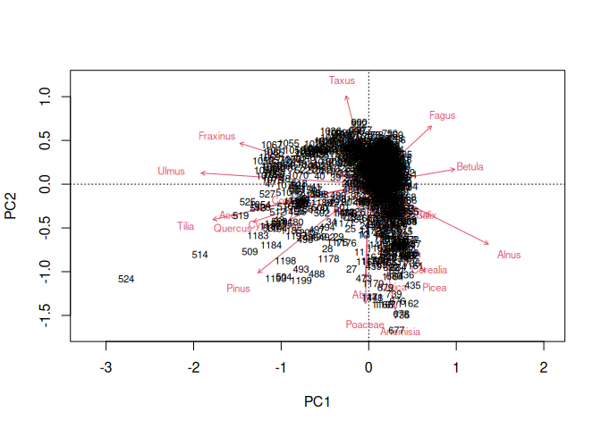
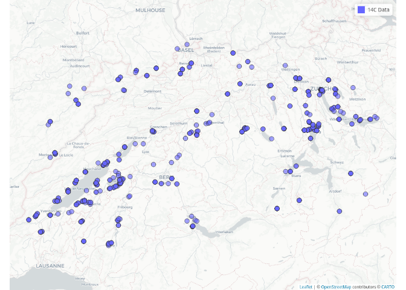
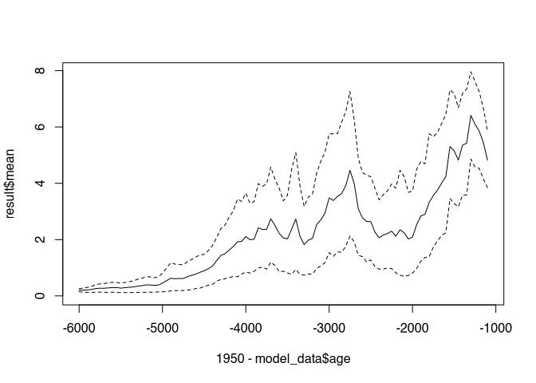
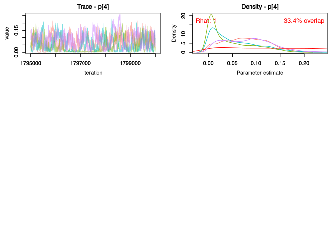
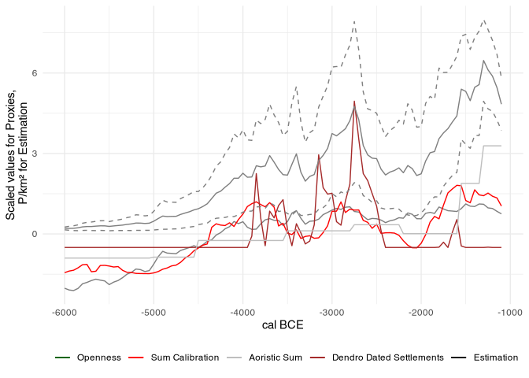

## Preface

Running through the analysis can take a long time, especially the Bayesian model. We point out the long runtimes again at the appropriate place.

## Loading the necessary libraries

For this analysis we need the following libraries:


```r
library(tidyverse)
library(ggdist)
library(reshape2)
library(here)
library(RcppRoll)
library(sf)
library(mapview)
library(vegan)
library(neotoma)
library(analogue)
library(rcarbon)
library(doParallel)
library(nimble)
library(coda)
library(MCMCvis)
library(fmcmc)
```

If you have not yet installed these libraries (and receive a corresponding error message), please install them!

For the aorist analysis we also use the package aoristAAR, which is not available on CRAN, but would have to be installed directly from GitHub:


```r
if(!require('devtools')) install.packages('devtools')
library(devtools)
install_github('ISAAKiel/aoristAAR')
require(aoristAAR)
```

## Data collection

The data used in this analysis are the following proxies obtained from the following sources:

-   An openness index generated by a PCA of five pollen profiles in the Swiss Plateau from the neotoma database [@williams2018].

-   ^14^C sum calibration, data sets from the XRONOS database as well as from the unpublished PhD thesis of Julian Laabs [\@laabs2019] and from the data collection of [\@martínez-grau2021].

-   Sites from the database of the Cantonal Archaeology <!--# which! --> as the basis of an aoristic analysis

-   The number of dated fell phases at lakeshore settlements in the Three Lakes Region from the doctoral thesis by Julian Laabs [\@laabs2019].

### Openness index

We start with the openness index, as this will set the spatial framework for our analyses. The five pollen profiles are the following:


```r
pollen_locations <- read.csv(file = normalizePath(file.path(here(), "data","raw_data", "pollen_locations.csv")))
pollen_locations
```

```
##   neotoma_id         name      lat      lng
## 1      26632    Le Loclat 47.01867 6.996690
## 2      46280      Moossee 47.02139 7.483806
## 3      40955 Burgaschisee 47.16969 7.668230
## 4      44723    Soppensee 47.09076 8.080880
## 5       4382       Rotsee 47.07556 8.325556
```

We can also map these. To do this, we first transform the coordinate system into the Swiss national coordinate system, and then display them:


```r
pollen_locations.sf <- st_as_sf(pollen_locations,
                                coords = c("lng", "lat"), # coordinate columns
                                crs = 4326)  # coordinate references system in epsg))
pollen_locations.sf.lv95 <- st_transform(pollen_locations.sf, crs = 2056)

pollenmap <- tempfile(fileext = ".png")
mapshot(
  mapview(pollen_locations.sf),
  file = pollenmap
  )

img <- magick::image_read(pollenmap)
plot(img)
```

<!-- -->

We download the data from neotoma:


```r
pollen_data <- get_download(pollen_locations$neotoma_id)
```

```
## Warning: 
## There were multiple entries for Lycopodium tablets 
## get_download has mapped aliases for the taxa in the taxon.list.
```

```
## Warning: 
## There were multiple entries for Abies alba 
## get_download has mapped aliases for the taxa in the taxon.list.
## There were multiple entries for Juniperus 
## get_download has mapped aliases for the taxa in the taxon.list.
## There were multiple entries for Lycopodium tablets 
## get_download has mapped aliases for the taxa in the taxon.list.
## There were multiple entries for Nymphaea 
## get_download has mapped aliases for the taxa in the taxon.list.
```

```
## Warning: 
## There were multiple entries for Abies alba 
## get_download has mapped aliases for the taxa in the taxon.list.
## There were multiple entries for Lycopodium tablets 
## get_download has mapped aliases for the taxa in the taxon.list.
## There were multiple entries for Nymphaea 
## get_download has mapped aliases for the taxa in the taxon.list.
## There were multiple entries for Pteridophyta (monolete) 
## get_download has mapped aliases for the taxa in the taxon.list.
```

```
## Warning: 
## There were multiple entries for Lycopodium tablets 
## get_download has mapped aliases for the taxa in the taxon.list.
## There were multiple entries for Pinus 
## get_download has mapped aliases for the taxa in the taxon.list.
```

Then we load a few help scripts which can be found under "code/neotoma_helpers.R".


```r
source(file = normalizePath(file.path(here(), "code", "neotoma_helpers.R")))
```

Now we filter the data sets so that we only retain the pollen data that record "NISP".


```r
pollen_data_filtered <- filter_by_unit(filter_by_element(pollen_data, "pollen"), "NISP")
class(pollen_data_filtered) <- append(class(pollen_data_filtered), "download_list")
```

Then we convert the NISP into percentages:


```r
pollen_data_comp <- transform_to_percent(pollen_data_filtered)
```

Furthermore, we need a (handwritten) concordance list for the taxa names:


```r
common_names <- read.csv(file = normalizePath(file.path(here(), "data","raw_data", "species.csv")), row.names = 1)
common_names
```

```
##                                    name_orig       name_joint
## 1                                      Abies            Abies
## 2                                 Abies alba            Abies
## 3                                       Acer             Acer
## 4                                   Achillea         Achillea
## 5                              Achillea-type         Achillea
## 6                                     Allium           Allium
## 7                                Allium-type           Allium
## 8                                      Alnus            Alnus
## 9                       Alnus glutinosa-type            Alnus
## 10                             Alnus viridis            Alnus
## 11                             Amaranthaceae    Amaranthaceae
## 12                        Amaranthaceae-type    Amaranthaceae
## 13                          Anemone nemorosa          Anemone
## 14                     Anemone nemorosa-type          Anemone
## 15                              Anemone-type          Anemone
## 16                               Anthemideae      Anthemideae
## 17                                  Apiaceae         Apiaceae
## 18                          Apiaceae undiff.         Apiaceae
## 19                                   Arctium          Arctium
## 20                                 Artemisia        Artemisia
## 21                                Aster-type            Aster
## 22                                Asteraceae       Asteraceae
## 23                               Asteroideae      Asteroideae
## 24                                Avena-type         Cerealia
## 25                                    Betula           Betula
## 26                               Betula nana           Betula
## 27                     Betula pubescens-type           Betula
## 28                      Bistorta officinalis         Bistorta
## 29                 Bistorta officinalis-type         Bistorta
## 30          Bistorta officinalis/B. vivipara         Bistorta
## 31                         Bistorta vivipara         Bistorta
## 32                              Brassicaceae     Brassicaceae
## 33                            Bupleurum-type        Bupleurum
## 34                                     Buxus            Buxus
## 35                        Buxus sempervirens            Buxus
## 36                                   Calluna          Calluna
## 37                          Calluna vulgaris          Calluna
## 38                          Caltha palustris          Calluna
## 39                               Caltha-type           Caltha
## 40                                 Campanula    Campanulaceae
## 41                             Campanulaceae    Campanulaceae
## 42                               Cannabaceae      Cannabaceae
## 43                 Cannabaceae sensu stricto      Cannabaceae
## 44                           Cannabis sativa      Cannabaceae
## 45                                   Carduus          Carduus
## 46                              Carduus-type          Carduus
## 47                                  Carpinus         Carpinus
## 48                          Carpinus betulus         Carpinus
## 49                                Carum-type            Carum
## 50                           Caryophyllaceae  Caryophyllaceae
## 51                   Caryophyllaceae undiff.  Caryophyllaceae
## 52                                  Castanea         Castanea
## 53                           Castanea sativa         Castanea
## 54                                 Centaurea        Centaurea
## 55                          Centaurea cyanus        Centaurea
## 56                    Centaurea montana-type        Centaurea
## 57                           Centaurea nigra        Centaurea
## 58                      Centaurea nigra-type        Centaurea
## 59                        Centaurea scabiosa        Centaurea
## 60                   Centaurea scabiosa-type        Centaurea
## 61                                Centaurium       Centaurium
## 62                                 Cerastium        Cerastium
## 63                            Cerastium-type        Cerastium
## 64          cf. Saxifraga oppositifolia-type        Saxifraga
## 65                        Chaerophyllum-type    Chaerophyllum
## 66                Chamaenerion angustifolium     Chamaenerion
## 67                             Cichorioideae    Cichorioideae
## 68                              Cirsium-type          Cirsium
## 69                          Cladium mariscus          Cladium
## 70                                  Clematis         Clematis
## 71                                Cornus mas           Cornus
## 72                          Cornus sanguinea           Cornus
## 73                            Cornus undiff.           Cornus
## 74                       Corydalis cava-type        Corydalis
## 75                                   Corylus          Corylus
## 76                          Corylus avellana          Corylus
## 77                                    Crepis           Crepis
## 78                                Cyperaceae       Cyperaceae
## 79                             Daucus carota           Daucus
## 80                               Daucus-type           Daucus
## 81                             Dianthus-type         Dianthus
## 82                                  Dipsacus         Dipsacus
## 83                          Dryas octopetala            Dryas
## 84                                Dryas-type            Dryas
## 85                                    Echium           Echium
## 86                         Ephedra distachya          Ephedra
## 87                    Ephedra distachya-type          Ephedra
## 88                          Ephedra fragilis          Ephedra
## 89                     Ephedra fragilis-type          Ephedra
## 90                                 Epilobium        Epilobium
## 91                                     Erica            Erica
## 92                                 Ericaceae        Ericaceae
## 93                         Ericaceae undiff.        Ericaceae
## 94                                  Eryngium         Eryngium
## 95                                  Fabaceae         Fabaceae
## 96                          Fabaceae undiff.         Fabaceae
## 97                                 Faboideae        Faboideae
## 98                                 Fagopyrum        Fagopyrum
## 99                                     Fagus            Fagus
## 100                          Fagus sylvatica            Fagus
## 101                        Falcaria vulgaris         Falcaria
## 102                            Falcaria-type         Falcaria
## 103                     Fallopia convolvulus         Fallopia
## 104                              Filipendula      Filipendula
## 105                                 Frangula         Frangula
## 106                           Frangula alnus         Frangula
## 107                                 Fraxinus         Fraxinus
## 108                       Fraxinus excelsior         Fraxinus
## 109                  Fraxinus excelsior-type         Fraxinus
## 110                                 Gentiana         Gentiana
## 111                              Geraniaceae      Geraniaceae
## 112                                 Geranium         Geranium
## 113                                     Geum             Geum
## 114                                Geum-type             Geum
## 115                          Gnaphalium-type       Gnaphalium
## 116                   Gypsophila repens-type       Gypsophila
## 117                          Gypsophila-type       Gypsophila
## 118                                   Hedera           Hedera
## 119                             Hedera helix           Hedera
## 120                             Helianthemum     Helianthemum
## 121                                Heracleum        Heracleum
## 122                         Hippocrepis-type      Hippocrepis
## 123                                Hippophaë        Hippophae
## 124                     Hippophaë rhamnoides        Hippophae
## 125                             Hordeum-type         Cerealia
## 126                                  Humulus          Humulus
## 127                                Hypericum        Hypericum
## 128                Hypericum perforatum-type        Hypericum
## 129                          Ilex aquifolium             Ilex
## 130                    Iris pseudacorus-type             Iris
## 131                                  Jasione          Jasione
## 132                                  Juglans          Juglans
## 133                            Juglans regia          Juglans
## 134                                   Juncus           Juncus
## 135                                Juniperus        Juniperus
## 136                           Juniperus-type        Juniperus
## 137                                  Knautia          Knautia
## 138                                Lamiaceae        Lamiaceae
## 139                        Lamiaceae undiff.        Lamiaceae
## 140                              Lamium-type           Lamium
## 141                            Larix decidua            Larix
## 142                                Lavandula        Lavandula
## 143                     Ligusticum mutellina       Ligusticum
## 144                                Ligustrum        Ligustrum
## 145                                Liliaceae        Liliaceae
## 146                        Liliaceae undiff.        Liliaceae
## 147                           Liliaceae-type        Liliaceae
## 148                 Linum usitatissimum-type            Linum
## 149                  Lonicera xylosteum-type         Lonicera
## 150                                    Lotus            Lotus
## 151                               Lotus-type            Lotus
## 152                           Lygeum spartum           Lygeum
## 153                 Lysimachia vulgaris-type       Lysimachia
## 154                                  Lythrum          Lythrum
## 155                                Malvaceae        Malvaceae
## 156                  Malvaceae sensu stricto        Malvaceae
## 157                              Mentha-type           Mentha
## 158                    Menyanthes trifoliata       Menyanthes
## 159                              Mercurialis      Mercurialis
## 160                        Mercurialis annua      Mercurialis
## 161                     Mercurialis perennis      Mercurialis
## 162                Mercurialis perennis-type      Mercurialis
## 163                             Muscari-type          Muscari
## 164                             Myriophyllum     Myriophyllum
## 165                    Myriophyllum spicatum     Myriophyllum
## 166               Myriophyllum spicatum-type     Myriophyllum
## 167                                   Nuphar           Nuphar
## 168                                 Nymphaea         Nymphaea
## 169                                Odontites        Odontites
## 170                           Odontites-type        Odontites
## 171                                 Oenanthe         Oenanthe
## 172                            Olea europaea             Olea
## 173                        Oxalis acetosella           Oxalis
## 174                                  Papaver          Papaver
## 175                      Papaver rhoeas-type          Papaver
## 176                                Parnassia        Parnassia
## 177                              Pedicularis      Pedicularis
## 178                      Persicaria amphibia       Persicaria
## 179                 Persicaria maculosa-type       Persicaria
## 180                          Peucedanum-type       Peucedanum
## 181                                    Picea            Picea
## 182                              Picea abies            Picea
## 183                    Pimpinella major-type       Pimpinella
## 184                          Pimpinella-type       Pimpinella
## 185                                    Pinus            Pinus
## 186                             Pinus cembra            Pinus
## 187                    Pinus sylvestris-type            Pinus
## 188                                 Pistacia         Pistacia
## 189                          Plantago alpina         Plantago
## 190                     Plantago alpina-type         Plantago
## 191                      Plantago lanceolata         Plantago
## 192                 Plantago lanceolata-type         Plantago
## 193                           Plantago major         Plantago
## 194                      Plantago major-type         Plantago
## 195                  Plantago major/P. media         Plantago
## 196             Plantago major/P. media-type         Plantago
## 197                           Plantago media         Plantago
## 198                      Plantago media-type         Plantago
## 199                         Plantago montana         Plantago
## 200                             Plantago sp.         Plantago
## 201                         Plantago undiff.         Plantago
## 202                           Plumbaginaceae   Plumbaginaceae
## 203                                  Poaceae          Poaceae
## 204                  Poaceae (Cerealia-type)         Cerealia
## 205          Poaceae (Cerealia-type) undiff.         Cerealia
## 206                       Poaceae (Cerealia)         Cerealia
## 207                             Polygonaceae     Polygonaceae
## 208                      Polygonum aviculare        Polygonum
## 209                                  Populus          Populus
## 210                              Potamogeton      Potamogeton
## 211                         Potamogeton-type      Potamogeton
## 212                          Potentilla-type       Potentilla
## 213                     Poterium sanguisorba         Poterium
## 214                            Prunella-type         Prunella
## 215                              Prunus-type           Prunus
## 216                                  Quercus          Quercus
## 217                        Quercus coccifera          Quercus
## 218                        Quercus ilex-type          Quercus
## 219                       Quercus robur-type          Quercus
## 220                            Ranunculaceae    Ranunculaceae
## 221                    Ranunculus acris-type       Ranunculus
## 222              Ranunculus sect. Batrachium       Ranunculus
## 223                          Ranunculus-type       Ranunculus
## 224                                  Rhamnus          Rhamnus
## 225                             Rhamnus-type          Rhamnus
## 226                               Rhinanthus       Rhinanthus
## 227                          Rhinanthus-type       Rhinanthus
## 228                             Rhynchospora     Rhynchospora
## 229                                    Ribes            Ribes
## 230                                     Rosa             Rosa
## 231                                 Rosaceae         Rosaceae
## 232                         Rosaceae (trees)         Rosaceae
## 233                 Rosaceae (trees) undiff.         Rosaceae
## 234                                Rubiaceae        Rubiaceae
## 235                                    Rubus            Rubus
## 236                                    Rumex            Rumex
## 237                       Rumex acetosa-type            Rumex
## 238                    Rumex acetosella-type            Rumex
## 239                               Rumex-type            Rumex
## 240                                    Salix            Salix
## 241                           Sambucus nigra         Sambucus
## 242                      Sambucus nigra-type         Sambucus
## 243                        Sambucus racemosa         Sambucus
## 244                   Sanguisorba minor-type      Sanguisorba
## 245                  Sanguisorba officinalis      Sanguisorba
## 246             Sanguisorba officinalis-type      Sanguisorba
## 247                  Saxifraga aizoides-type        Saxifraga
## 248                 Saxifraga granulata-type        Saxifraga
## 249                            Saxifragaceae    Saxifragaceae
## 250                              Scleranthus      Scleranthus
## 251                          Scorzonera-type       Scorzonera
## 252                         Scrophulariaceae Scrophulariaceae
## 253                                   Secale         Cerealia
## 254                                    Sedum            Sedum
## 255                               Sedum-type            Sedum
## 256                             Senecio-type          Senecio
## 257                            Silene dioica           Silene
## 258                       Silene dioica-type           Silene
## 259                          Silene vulgaris           Silene
## 260                     Silene vulgaris-type           Silene
## 261                                  Solanum          Solanum
## 262                                   Sorbus           Sorbus
## 263                              Sorbus-type           Sorbus
## 264                               Sparganium       Sparganium
## 265                          Sparganium-type       Sparganium
## 266                            Spermatophyta    Spermatophyta
## 267 Spermatophyta undiff. (cf. upland herbs)    Spermatophyta
## 268     Spermatophyta undiff. (upland herbs)    Spermatophyta
## 269                                  Succisa          Succisa
## 270                                    Taxus            Taxus
## 271                            Taxus baccata            Taxus
## 272                               Thalictrum       Thalictrum
## 273                                    Tilia            Tilia
## 274                            Tilia cordata            Tilia
## 275                         Torilis arvensis          Torilis
## 276                    Torilis arvensis-type          Torilis
## 277                         Torilis japonica          Torilis
## 278                    Torilis japonica-type          Torilis
## 279                                    Trapa            Trapa
## 280                             Trapa natans            Trapa
## 281                                Trifolium        Trifolium
## 282                  Trifolium pratense-type        Trifolium
## 283                    Trifolium repens-type        Trifolium
## 284                           Trifolium-type        Trifolium
## 285                            Triticum-type         Cerealia
## 286                                 Trollius         Trollius
## 287                        Tussilago farfara        Tussilago
## 288                                    Typha            Typha
## 289                          Typha latifolia            Typha
## 290                     Typha latifolia-type            Typha
## 291                                    Ulmus            Ulmus
## 292                                   Urtica           Urtica
## 293                            Urtica dioica           Urtica
## 294                               Urticaceae       Urticaceae
## 295                              Utricularia      Utricularia
## 296                           Vaccinium-type        Vaccinium
## 297                                Valeriana        Valeriana
## 298                    Valeriana dioica-type        Valeriana
## 299               Valeriana officinalis-type        Valeriana
## 300                           Valeriana-type        Valeriana
## 301                           Valerianoideae   Valerianoideae
## 302                                 Viburnum         Viburnum
## 303                     Viburnum opulus-type         Viburnum
## 304                                Violaceae        Violaceae
## 305                                   Viscum           Viscum
## 306                             Viscum album           Viscum
## 307                                    Vitis            Vitis
## 308                                 Zea mays              Zea
```

With this concordance table we combine the species with respect to their genus:


```r
pollen_data_comp <- aggregate_by_joint_name(pollen_data_comp, common_names = common_names)
```

Now we can combine the individual pollen profiles into an overall table, where each row represents a sample:


```r
all_output <- suppressWarnings(neotoma::compile_downloads(pollen_data_comp))
```

We restrict the data set to the Holocene so that we no longer have the pre-Holocene developments in the principal component analysis:


```r
timeframe <- c(-7000,-1000)
all_output <- subset(all_output, 1950-age > timeframe[1] & 1950-age < timeframe[2])
```

Then we extract the actual data:


```r
all_data <- all_output[,11:ncol(all_output)]
all_data[is.na(all_data)] <- 0
```

We then filter the data. Only those taxa are considered which are present in at least 1/3 of all data series:


```r
all_data <- all_data[ , colSums(all_data) != 0]
all_data <- all_data[,colSums(all_data>0)>(nrow(all_data)/3)]
```

In addition, only those with an average frequency greater than 0.1% are included:


```r
all_data <- all_data[,colMeans(all_data)>0.1]
```

However, we add the *cerealia* back in, regardless of their frequency:


```r
if(!("Cerealia" %in% colnames(all_data)))
{
  all_data <- data.frame(all_data, Cerealia = all_output[,"Cerealia"])  
}
```

These data can now be evaluated by means of a principal component analysis:


```r
res.pca <- rda(all_data, scale = TRUE)
biplot(res.pca, type="text")
```

<!-- -->

This calculation already shows the familiar structure that we have the known open land indicators at one end of the spectrum and the forest species (tree pollen) at the other. However, the result is also influenced by a gradient which has nothing to do with the effect we are interested in: The immigration of beech. To eliminate this gradient, we use a partial RDA in which only the residuals for Fagus are evaluated:


```r
res.pca <- rda(all_data ~ Condition(Fagus), data=all_data, scale = TRUE)
biplot(res.pca, type="text")
```

```
## Warning in arrows(0, 0, g$species[, 1] * arrlen, g$species[, 2] * arrlen, :
## zero-length arrow is of indeterminate angle and so skipped
```

<!-- -->

From this principal component analysis, we now extract the first dimension as the openness index, and supplement it with the datings of the individual samples. In doing so, we ensure that open land indicators end up on the positive side of the result vector:


```r
orientation <- sign(scores(res.pca)$species["Cerealia",1])
res.open <- data.frame(scores(res.pca, choices = 1, display = "si")*orientation)
colnames(res.open) <- "score"
res.open$age <- all_output$age
res.open$site <- all_output$site.name
ggplot(res.open) + geom_line(aes(x = 1950-age, y = score, color = site))
```

<!-- -->

The individual profiles show a very similar development over time. We now summarise the common trend and smooth it with a 50-year moving window. For this, however, we first have to interpolate shared points in time, which we do via a linear approximation:


```r
sw <- 50

full_range <- full_seq(res.open$age, 1)

res.open.interpolated <- by(res.open, res.open$site, function(x) approx(x$age,x$score, full_range)$y)

res.open.interpolated <- data.frame(do.call(cbind, res.open.interpolated))

res.open.interpolated$age <- full_range

res.open.interpolated <- melt(res.open.interpolated, id.vars=c("age"))

res.open.interpolated$site <- res.open.interpolated$variable

res.open.interpolated$variable <- NULL

res.open_smoothed <- res.open.interpolated %>% 
  group_by(site) %>%
  # RcppRoll::roll_mean() is written in C++ for speed 
  mutate(moving_mean = roll_mean(value, sw, fill = NA, na.rm = TRUE))

res.open_smoothed$value<-NULL
res.open_smoothed <- na.omit(res.open_smoothed)
```

Then we pick every 50th date:


```r
res.open_smoothed <- res.open_smoothed[res.open_smoothed$age %in%
seq(from=1000,
    to=10000, by=50),]
ggplot(res.open_smoothed,aes(x=1950-age,y=moving_mean)) +
  geom_point(aes(color=site), alpha =.5) +
  geom_smooth(span = 0.05, color = "black") +
  scale_x_continuous(breaks=seq(timeframe[1],timeframe[2],200), limits = timeframe) +
  labs(y = "Openness score [PCA]",x = "Date",colour = "Sites") +
  theme_minimal() +
  theme(axis.text.x = element_text(angle = 45, hjust = 1))
```

```
## `geom_smooth()` using method = 'loess' and formula 'y ~ x'
```

<!-- -->

Finally, we calculate the average of all profiles as the final supra-regional openness index.


```r
res.open_final <- res.open_smoothed %>%
  group_by(age) %>%
  mutate(mean=mean(moving_mean),
         sd = sd(moving_mean)) %>% 
  select(age,mean,sd) %>%
  unique()  %>% arrange(desc(age))

ggplot(res.open_final,aes(x=1950-age)) +
  geom_line(aes(y=mean)) +
  geom_segment(aes(y=mean-sd, yend =mean+sd, xend=1950-age), alpha = .25)
```

<!-- -->

### ^14^C Summenkalibration

The data set for the 14C sum calibration is composed of the above-mentioned sources.


```r
c14 <- read.csv(file = normalizePath(file.path(here(), "data","raw_data", "14c_swiss_plateau.csv")))
```

We can show this on the map:


```r
c14map <- tempfile(fileext = ".png")
mapshot(
  mapview(st_as_sf(c14,
                   coords = c("lng", "lat"), 
                   crs = 4326),layer.name = "14C Data"
          ),
  file = c14map
  )

img <- magick::image_read(c14map)
plot(img)
```

<!-- -->

Next, we calibrate the 14C data using rcarbon: <!--# uncal vs cal? -->


```r
c14.calibrated <- calibrate(x = c14$bp, errors = c14$std, verbose = F)
```

Subsequently, we perform the sum calibration, whereby we perform a binning at the level of the sites:


```r
sumcal <- spd(c14.calibrated, timeRange = 1950-timeframe, bins = c14$site, runm = sw, verbose = F)
```

Below is the visualisation of the sum calibration:


```r
plot(1950-sumcal$grid$calBP, sumcal$grid$PrDens,type="l", main = paste0("n=", length(c14.calibrated)))
```

<!-- -->

Finally, we extract the values every 50 years:


```r
res.sumcal <- sumcal$grid[sumcal$grid$calBP %in%
seq(from=1000,
    to=10000, by=50),]
```

### Aoristic Site Count

The third proxy is the aoristic sum of the number of sites from the cantonal archaeology database. For these, we have obscured the coordinates to avoid the well-known problems that can arise from clear site coordinates.


```r
sites <- read.csv(file = normalizePath(file.path(here(), "data","raw_data", "site_data_fuzzy.csv")))
```

We can depict this on the map:


```r
sitesmap <- tempfile(fileext = ".png")
mapshot(
  mapview(st_as_sf(sites,
                   coords = c("LV03_Rechtswert_fuzzy", "LV03_Hochwert_fuzzy"),
                   crs = 21781),
          layer.name = "Sites"
  ),
  file = sitesmap
)
img <- magick::image_read(sitesmap)
plot(img)
```

<!-- -->

The dates come in two categories, rough and very rough We use the rough datings where they are available. Where they are not, we fall back on the very rough dates. But first we load the concordance table:


```r
chrono_rough <- read.csv(file = normalizePath(
  file.path(here(), "data","raw_data", "chrono_rough.csv")
  ),
  row.names = 1)

chrono_vrough <- read.csv(file = normalizePath(
  file.path(here(), "data","raw_data", "chrono_very_rough.csv")
  ),
  row.names = 1)
```

Next, we prepare the beginning and end as a column:


```r
sites$begin <- NA
sites$end <- NA
```

And then we first fill these columns with the data from the very rough dating:


```r
for(i in 1:nrow(chrono_vrough)){
  this_phase <- chrono_vrough[i,]
  sites$begin[sites$chrono_very_rough == this_phase[,1]] <- this_phase$dat_begin
  sites$end[sites$chrono_very_rough == this_phase[,1]] <- this_phase$dat_end
}
```

Where available, we overwrite the very rough dating with the rough dating:


```r
for(i in 1:nrow(chrono_rough)){
  this_phase <- chrono_rough[i,]
  sites$begin[sites$chrono_rough == this_phase[,1]] <- this_phase$dat_begin
  sites$end[sites$chrono_rough == this_phase[,1]] <- this_phase$dat_end
}
```

However, this does not allow for a very precise dating:


```r
table(sites$begin)
```

```
## 
## -10000  -6000  -5000  -4500  -3500  -2750  -2200  -1550  -1300 
##   2520     11     11    219    250    223    195    223    669
```

Nevertheless, we next use the aorist sum as a mapping of the expected value for simultaneously existing settlements:


```r
res.aorist <- aorist(sites, from = "begin", to = "end", method = "weight")

res.aorist$age <- 1950-res.aorist$date
res.aorist <- subset(res.aorist, date >= timeframe[1] & date <= timeframe[2])
```

Again, the curve of the proxy is plotted here also:


```r
plot(res.aorist$date, res.aorist$sum,type="l", main = paste0("n=", nrow(sites)))
```

<!-- -->

Once more, we extract the values every 50 years:


```r
res.aorist <- res.aorist[res.aorist$age %in%
seq(from=1000,
    to=10000, by=50),]
```

### Dendro Dated Settlements

This year-by-year dataset maps the number of lakeshore settlements in the Three Lakes Region. Details can be found in the publication by [@laabs2019]. To match the resolution of the other datasets, this dataset is also sampled at 50-year intervals, and smoothed accordingly beforehand using a moving average.

First we load the data:


```r
lss <- read.csv(file = normalizePath(file.path(here(), "data","raw_data", "dendro_years.csv")))
```

Then we complete the data set so that it covers the entire period under consideration:


```r
lss <- rbind(data.frame(date=-7050:min(lss$date)-1,n_settlements=0),
             lss,
             data.frame(date=max(lss$date)+1:-1,n_settlements=0))
```

Finally, we run a moving average over it with the same window as for the other data sets:


```r
res.lss <- lss %>% 
  mutate(moving_mean = roll_mean(n_settlements, sw, fill = NA, na.rm = TRUE))
```

Here is yet another plot of the resulting curve:


```r
plot(res.lss$date, res.lss$moving_mean,type="l")
```

<!-- -->

Picking the data points every 50 years again:


```r
res.lss <- res.lss[res.lss$date %in% seq(from=timeframe[1],
                                         to=timeframe[2], by=50),
        ]
res.lss$age <- 1950-res.lss$date
```

### Combining the proxies

Thus we have all proxies available, and can display them (scaled) all together:


```r
ggplot() +
  geom_line(data = res.open_final, aes(x = 1950-age, y = scale(mean)), col="darkgreen", alpha = 0.75) +
  geom_line(data = res.sumcal, aes(x = 1950-calBP, y = scale(PrDens)), col="red", alpha = 0.75) +
  geom_line(data = res.aorist, aes(x = date, y = scale(sum)), col="gray", alpha = 0.75) + 
  geom_line(data = res.lss, aes(x = date, y = scale(moving_mean)), col="brown", alpha = 0.75) +
  scale_colour_manual(values = c("darkgreen", "red", "gray", "brown"),
                      labels = c("Openness Indicator", "Sum Calibration", "Aoristic Sum", "Dendro Dated Settlements")
                      )
```

<!-- -->

We merge the dataset and restrict it to our observation window:


```r
all_proxies <- merge(res.sumcal, res.open_final, by.x = "calBP", by.y = "age") %>%
  merge(res.aorist, by.x = "calBP", by.y = "age") %>%
  merge(res.lss, by.x = "calBP", by.y = "age") %>%
  select(calBP, PrDens, mean, sum, moving_mean) %>%
  rename(age = calBP, sumcal = PrDens, openness = mean, aoristic_sum = sum, dendro = moving_mean) %>%
  filter(age < 8000 & age > 3000)

all_proxies
```

```
##     age      sumcal     openness aoristic_sum dendro
## 1  3050 0.066822335  0.208384980    1.5927066   0.00
## 2  3100 0.074485506  0.242881761    1.5927066   0.00
## 3  3150 0.076114100  0.281868030    1.5927066   0.00
## 4  3200 0.079103652  0.290201574    1.5927066   0.02
## 5  3250 0.076607414  0.340102162    1.5927066   0.00
## 6  3300 0.077399806  0.343925688    1.1476075   0.00
## 7  3350 0.082184602  0.308968436    1.1476075   0.00
## 8  3400 0.069906533  0.314034077    1.1476075   0.00
## 9  3450 0.072067256  0.344624229    1.1476075   0.00
## 10 3500 0.086024535  0.280680369    1.1476075   0.10
## 11 3550 0.086466548  0.240770602    0.5524875   1.90
## 12 3600 0.083044453  0.246534209    0.5524875   1.04
## 13 3650 0.079256491  0.251538159    0.5524875   0.00
## 14 3700 0.067631106  0.275499947    0.5524875   0.36
## 15 3750 0.054685814  0.302162680    0.5524875   0.02
## 16 3800 0.056976711  0.214063576    0.5524875   0.00
## 17 3850 0.051602863  0.228752154    0.5524875   0.00
## 18 3900 0.039628205  0.215398897    0.5524875   0.00
## 19 3950 0.031508932  0.140657882    0.5524875   0.00
## 20 4000 0.027173504  0.141423918    0.5524875   0.00
## 21 4050 0.027255637  0.202031563    0.5524875   0.00
## 22 4100 0.029648725  0.220653356    0.5524875   0.00
## 23 4150 0.033925231  0.148148300    0.5524875   0.00
## 24 4200 0.039132116  0.154931912    0.6582183   0.00
## 25 4250 0.041154140  0.126431788    0.6582183   0.00
## 26 4300 0.041522473  0.112615712    0.6582183   0.00
## 27 4350 0.041450995  0.087794472    0.6582183   0.00
## 28 4400 0.040868299  0.122513325    0.6582183   1.14
## 29 4450 0.049577228  0.141062476    0.6582183   2.82
## 30 4500 0.045708064  0.145163541    0.6582183   3.68
## 31 4550 0.051364376  0.128273642    0.6582183   4.56
## 32 4600 0.053219479  0.176169459    0.6582183   5.04
## 33 4650 0.063089590  0.232560870    0.6582183   7.38
## 34 4700 0.062966055  0.240455540    0.6582183   9.98
## 35 4750 0.063906897  0.304712832    0.5858036   4.32
## 36 4800 0.060668706  0.299462802    0.5858036   3.18
## 37 4850 0.070734298  0.269143447    0.5858036   1.52
## 38 4900 0.061940376  0.283473503    0.5858036   1.76
## 39 4950 0.061840906  0.260374216    0.5858036   3.70
## 40 5000 0.048085633  0.227507896    0.5858036   3.64
## 41 5050 0.041661667  0.197560355    0.5858036   4.08
## 42 5100 0.036659123  0.135159729    0.5858036   6.32
## 43 5150 0.036252694  0.111661900    0.5858036   1.54
## 44 5200 0.038626613  0.106474553    0.5858036   0.44
## 45 5250 0.038011881  0.066037589    0.5858036   0.24
## 46 5300 0.036061853  0.148150601    0.5858036   1.00
## 47 5350 0.044172607  0.252045559    0.5858036   1.62
## 48 5400 0.039789429  0.218854660    0.5858036   0.12
## 49 5450 0.041097990  0.101743462    0.5858036   1.24
## 50 5500 0.050443184  0.049206510    0.4712444   3.26
## 51 5550 0.047927229  0.118121328    0.4712444   2.86
## 52 5600 0.065738448  0.119418131    0.4712444   2.02
## 53 5650 0.069992361  0.142334032    0.4712444   2.48
## 54 5700 0.066124322  0.125863453    0.4712444   0.12
## 55 5750 0.068238904  0.070361025    0.4712444   2.00
## 56 5800 0.070823199 -0.001876524    0.4712444   5.04
## 57 5850 0.069055479 -0.005537506    0.4712444   0.78
## 58 5900 0.066352719  0.024292896    0.4712444   0.00
## 59 5950 0.059217177  0.099740737    0.4712444   0.00
## 60 6000 0.054011583  0.074216521    0.4712444   0.00
## 61 6050 0.047448525  0.102850247    0.4712444   0.00
## 62 6100 0.050931150  0.032218519    0.4712444   0.00
## 63 6150 0.048327174  0.002158157    0.4712444   0.00
## 64 6200 0.048757293 -0.050685052    0.4712444   0.00
## 65 6250 0.049973770 -0.082990987    0.4712444   0.00
## 66 6300 0.046612903 -0.148351822    0.4712444   0.00
## 67 6350 0.030864996 -0.169873195    0.4712444   0.00
## 68 6400 0.029696608 -0.217747060    0.4712444   0.00
## 69 6450 0.026986578 -0.252535632    0.4712444   0.00
## 70 6500 0.024363059 -0.229672251    0.2740693   0.00
## 71 6550 0.020120908 -0.254545594    0.2740693   0.00
## 72 6600 0.017377696 -0.275154304    0.2740693   0.00
## 73 6650 0.013428797 -0.295576295    0.2740693   0.00
## 74 6700 0.010793309 -0.339686062    0.2740693   0.00
## 75 6750 0.010069610 -0.335459548    0.2740693   0.00
## 76 6800 0.008092049 -0.331121741    0.2740693   0.00
## 77 6850 0.006905459 -0.307124230    0.2740693   0.00
## 78 6900 0.004728914 -0.379629880    0.2740693   0.00
## 79 6950 0.003444082 -0.481231197    0.2740693   0.00
## 80 7000 0.002725530 -0.572219988    0.2630362   0.00
## 81 7050 0.002769597 -0.584561859    0.2630362   0.00
## 82 7100 0.002822575 -0.558309763    0.2630362   0.00
## 83 7150 0.002955175 -0.550253177    0.2630362   0.00
## 84 7200 0.003835058 -0.595948653    0.2630362   0.00
## 85 7250 0.003977789 -0.620649756    0.2630362   0.00
## 86 7300 0.005880774 -0.669118051    0.2630362   0.00
## 87 7350 0.009411231 -0.708101976    0.2630362   0.00
## 88 7400 0.009024750 -0.730095356    0.2630362   0.00
## 89 7450 0.009956543 -0.764593725    0.2630362   0.00
## 90 7500 0.010598909 -0.714226091    0.2630362   0.00
## 91 7550 0.010446669 -0.703030375    0.2630362   0.00
## 92 7600 0.004991715 -0.689720794    0.2630362   0.00
## 93 7650 0.004557871 -0.708806053    0.2630362   0.00
## 94 7700 0.011493922 -0.734169663    0.2630362   0.00
## 95 7750 0.011148106 -0.753663803    0.2630362   0.00
## 96 7800 0.008221919 -0.817119776    0.2630362   0.00
## 97 7850 0.005961681 -0.846477926    0.2630362   0.00
## 98 7900 0.005158777 -0.838409684    0.2630362   0.00
## 99 7950 0.003657409 -0.814292379    0.2630362   0.00
```

We might like to store the result for the actual analysis:


```r
write.csv(all_proxies, file = normalizePath(
  file.path(here(), "data","preprocessed_data", "all_proxies.csv"
            ),
  mustWork = F)
  )
```

## Transforming the Data

If the data has already been created in a previous run, we can also reload it directly at this point:


```r
all_proxies <- read.csv(file = normalizePath(
  file.path(here(), "data","preprocessed_data", "all_proxies.csv")
  ),
  row.names = 1)
```

First we reverse the order of the data so that it is sorted from oldest to youngest:


```r
all_proxies <- all_proxies %>% arrange(desc(age))
```

Since the data influence the model in their respective change from the state t -\> t-1, we first normalise them by a z-transformation, and then calculate the individual difference to the predecessor. The first row is set to 0.


```r
all_proxies[,2:5] <- all_proxies[,2:5] %>% scale() %>% diff() %>% rbind(0,.)
```

Furthermore, it has proven practical, at least in the development phase of the model, to be able to restrict the data set in order to quickly try out responses of the model. Each data point is included in the model as a separate parameter, and it therefore does not scale linearly with the number of data points. It can also be helpful for reproducing the analysis. To do this, we define a reduction factor that determines what proportion of the data is passed to the model and reduce the data set accordingly.


```r
redux_factor <- 1
redux_nrow <- round(nrow(all_proxies) * redux_factor)
redux_seq <- round(seq(from=1,to=nrow(all_proxies), length.out = redux_nrow))

model_data <- all_proxies[redux_seq,]
```

Furthermore, the model contains two constraints for the maximum growth rate. These help to speed up convergence. They are given as data and must be set to 1 for the constraint to be processed.


```r
model_data$constraint_lambda_lower <- 1
model_data$constraint_lambda_upper <- 1
```

## The Model

The actual model consists of a nimble code block that describes the relationships and sets the priors for the parameters:


```r
model_code <- nimbleCode( {
  # ---- Process Model ----
  
  # Estimate the initial state vector of population abundances
  nEnd ~ dnorm(nSites[nYears] * MeanSiteSize / AreaSwissPlateau, sd=0.5)

  # Autoregressive process for remaining years
  for(t in 2:(nYears)) {
    # The actual number of sites per year
    nSites[t] ~ dpois(lambda[t])
    
    # limiting the change to a maximum value, estimated in the model
    constraint_lambda_lower[t] ~ dconstraint(
      nSites[t]/nSites[t-1] < (max_growth_rate + 1)
      )
    constraint_lambda_upper[t] ~ dconstraint(
      nSites[t-1]/nSites[t] < (max_growth_rate + 1)
      )
  }
  
  # ---- Observational Model ----

  # For all but the first year
  for(t in 2:(nYears)) {
    # lambda depends on the number of sites at the previous year, plus
    # changes in relation to the proxies
    log(lambda[t]) <- log(nSites[t-1]) + (
      p[1] * sumcal[t]  +
        p[2] * openness[t] +
        p[3] * aoristic_sum[t] + 
        p[4] * dendro[t]
      )
  }
  # ---- Priors ----
  # Relevance of the proxies is estimated as Dirichlet distribution
  p[1:4] ~ ddirch(alpha[1:4])
  
  # The parameters for the Dirichlet distribution have a weakly informative prior
  for(j in 1:4) {
    alpha[j] ~ dlnorm(mu_alpha[j],sdlog=a_alpha[j])
    a_alpha[j] ~ dexp(1)
    mu_alpha[j] ~ dlnorm(1,sdlog=0.1)
  }
  
  # The maximum growth rate has a prior gamma distributed between 0 and 1
  # by adding 1 in the process model, this becomes 1-2[
  max_growth_rate ~ dgamma(shape = 5, scale=0.05)

  # The mean site size
  MeanSiteSize ~ dpois(50)
    
  # ---- transformed data ----
  
  # Population density and total population as function of site number
  PopDens[1:(nYears)] <- PopTotal[1:(nYears)] / AreaSwissPlateau
  PopTotal[1:nYears] <- nSites[1:nYears] * MeanSiteSize
})
```

## Run Preparation

A few things still need to be specified for the model: constants and initial values. Let's start with the constants:


```r
model_constants <- list(
  # an estimation for the population density at the end of the modeled period
  nEnd = 5, 
  # the number of time slices
  nYears = redux_nrow,
  # the area of the swiss plateau for the transformation
  # of population density to Total Population
  AreaSwissPlateau = 12649
  )
```

Finally, it helps for convergence to give meaningful starting values for the chains:


```r
# Calculation of an exponential increase of the factor 10
r <- log(1 - (10^(1/model_constants$nYears) - 1))
model_inits <- list(
  lambda = rep(r,redux_nrow),
  PopDens = rep(model_constants$nEnd,redux_nrow),
  nSites = rep(50,redux_nrow)
)
```

Furthermore, we set the parameters for the runs until convergence:


```r
batches <- 100000 # run in batches of this length
thinning <- 10 # save only each ... of the chains
```

Finally, we have to define which parameters (apart from the top-level stochastic nodes of the model) are to be observed and stored. We also include the population density as a core parameter and the relative proportion of proxies p:


```r
model_monitors <- c("PopDens", "p")
```

## Parallelisation

The model runs significantly faster if we use multiple cores in parallel. Nimble itself does not have an option for parallelisation, so we use functions provided by the package `do_parallel` for this. The computer used for the analysis has 4 cores, you may need to adjust these values for your computer.


```r
# Spare 4 cores from the calculation
ncore <- detectCores() - 4
ncore <- max(ncore, 1)

# Register the cluster
cl <- makeCluster(ncore)
registerDoParallel(cl)

# Export common values for the cluster
clusterExport(cl,
              c("model_code",
                "model_inits",
                "model_data",
                "model_constants",
                "model_monitors",
                "batches",
                "thinning"
                )
              )

# Set random seeds
for (j in seq_along(cl)) {
  set.seed(j)
}
```

## First batch

In the first run, the clusters are set up and the models are instantiated and started within the clusters.


```r
start_time <- Sys.time()

mcmcSamples <- clusterEvalQ(cl, {
  
  # Load necessary libraries
  library(nimble)
  library(coda)
  
  # initiate the model with the parameters and dates
  model <- nimbleModel(code=model_code,
                       data=model_data,
                       constants = model_constants,
                       inits = model_inits)
  
  # Compile the model
  Cmodel <- compileNimble(model)
  
  # Configure the model
  modelConf <- configureMCMC(model, thin = thinning)
  
  # Add the monitor(s)
  modelConf$addMonitors(model_monitors)
  
  # Build the mcmc
  modelMCMC <- buildMCMC(modelConf)
  
  # Compile the final model
  CmodelMCMC <- compileNimble(modelMCMC, project = model)
  
  # Run the model for the number of iterations specified in batches
  CmodelMCMC$run(batches, reset = FALSE)
  return(as.mcmc(as.matrix(CmodelMCMC$mvSamples)))
})


end_time <- Sys.time()
end_time - start_time
```

```
## Time difference of 58.40906 secs
```

At the end of the 1st run, the model is instantiated in the individual cluster partitions, possibly already converged. But we now check the convergence in continued runs.


```r
# Initialize with non-convergence
converged <- F

# minimum psrf until the model is considered converged
min_convergence <- 1.1

start_time <- Sys.time()

# As long as not converged
while (!converged) {
  
  # run the model for another batch, with resetting the values (burn-in)
  mcmcSamples <- clusterEvalQ(cl, {
    CmodelMCMC$run(batches, reset = FALSE, resetMV = TRUE)
    return(as.mcmc(as.matrix(CmodelMCMC$mvSamples)))
  })

  # convert the resulting list to an mcmc.list object
  mcmcSamples <- as.mcmc.list(mcmcSamples)

  # Check the psrf values from the Gelman and Rubin's convergence diagnostic
  gelman <- gelman.diag(mcmcSamples, multivariate = F)
  psrf <- gelman$psrf[,1]

  # The model is considered converged when
  # all psrf are lower than the minimum convergence criterion
  converged <- all(psrf<min_convergence, na.rm=T)
  
  # optional: create an mcmc traceplot for visual inspection
  #MCMCtrace(window(mcmcSamples, start = (batches/thinning)-min((batches/thinning),5000)), params = "PopDens", pdf = F)
}

end_time <- Sys.time()
end_time - start_time
```

```
## Time difference of 35.15003 secs
```

Once the model has converged, we can look at the result of estimating the population density based on the number of settlements. For this we extract the mean and 95% highest posterior density interval:


```r
result <- MCMCsummary(mcmcSamples, HPD = T, params = "PopDens")

plotmax <- max(result$`95%_HPDU`)

plot(1950-model_data$age, result$mean, type="l", ylim = c(0,plotmax))
lines(1950-model_data$age, result$`95%_HPDL`, lty=2)
lines(1950-model_data$age, result$`95%_HPDU`, lty=2)
```

<!-- -->

This converged run is sufficient to check some initial parameter values. For example, we can see how the proportional importance of the proxies is distributed:


```r
MCMCchains(mcmcSamples, params = "p") %>%
  as.data.frame %>%
  rename(sumcal = 'p[1]', openness = 'p[2]', aorist = 'p[3]', dendro = 'p[4]') %>%
  pivot_longer(everything()) %>%
  ggplot(aes(x = value, y = name)) + stat_halfeye()
```

<!-- -->

The model trusts mainly the openness index, the aoristic sum and the dendro data play a subordinate role. The sum calibration has a higher weight. However, the shape of the distributions also indicates that we may have too few effective samples to make a reliable statement about the highest posterior density intervals. Let's take a look at the effective samples:


```r
MCMCsummary(mcmcSamples) %>%
  as.data.frame() %>%
  rownames_to_column() %>%
  ggplot() + geom_bar(aes(y=n.eff, x=rowname), stat = "identity") + coord_flip()
```

<!-- -->

Very few parameters have already reached the effective sample size of 10000 suggested for a reliable estimate. Therefore, we extend the run until this number is reached.

## Finale Run after Convergence

The final run after convergence to get more than the min 10000 effective samples for each parameter takes quite some time. On my machine, it took nearly 5 hours. Therefore, I add a switch here for not doing this analysis, but feel free to proceed yourself, if you like:


```r
do_final_run = F
```

First we set our new meta-parameters:


```r
# Starting with not enough samples
enough_samples <- F

# We want at least 10000 effective samples
min_eff_samples <- 10000

# We prolongue the batches for more time efficient sampling
sample_batches <- 1000000
```

Then we export the new batch length to the clusters:


```r
clusterExport(cl, c("sample_batches"))
```

In order to work memory-efficiently (the model can need a lot of memory quickly!), we only allow the current samples to be used within the cluster instances and collect them outside the clusters in a variable:


```r
start_time <- Sys.time()
while (!enough_samples & do_final_run) {
  
  gc(verbose=F) # Garbage collector for more RAM

  # Start sampling  
  mcmcSamples <- clusterEvalQ(cl, {
    CmodelMCMC$run(sample_batches, reset = FALSE, resetMV = TRUE)
    return(as.mcmc(as.matrix(CmodelMCMC$mvSamples)))
  })
  
  mcmcSamples <- as.mcmc.list(mcmcSamples)
  
  # create or append values to a collector variable
  if(!exists("collector")){
    collector <- mcmcSamples
  } else {
    collector <- append_chains(collector, mcmcSamples)
  }
  
  # calculate effective sample size iteratively over the chains
  # and then sum the individual values
  # more RAM efficient than the `MCMCsummary` implementation
  mcmcsummary <- lapply(collector, effectiveSize)
  ness <- Reduce(`+`, mcmcsummary)
  
  # we have enough samples, when all parameters have more than the minimum ESS
  enough_samples <- all(ness >  min_eff_samples)

  # just in case: store the result in a RDS file for later inspection  
  saveRDS(collector, file = "mcmc_collector.RDS")
}

end_time <- Sys.time()
end_time - start_time
```

```
## Time difference of 0.01296329 secs
```

When the model has finished running, we should stop the clusters:


```r
stopCluster(cl)
```

If the final run above was skipped, but you have already the results from a previous run, you can load this at this stage:


```r
collector <- readRDS("mcmc_collector.RDS")
```


For comparison with the priors, we simulate from these, first for p:


```r
n_prior <- 100000
a_alpha <- mu_alpha <- alpha <- list()

for(j in 1:4) {
a_alpha[[j]] <- rexp(n_prior, 1)
mu_alpha[[j]] <- rlnorm(n_prior, 1,sdlog=0.1)
alpha[[j]] <- rlnorm(n_prior, mu_alpha[[j]],sdlog=a_alpha[[j]])
}

p_mat <- matrix(ncol = 4, nrow = n_prior)
for(i in 1:n_prior){
 p_mat[i,] <- rdirch(1, c(alpha[[1]][i], alpha[[2]][i], alpha[[3]][i], alpha[[4]][i]))
}
MCMCtrace(collector, params = "p", priors = p_mat, pdf = F, ind = T, Rhat = T)
```

```
## Warning in MCMCtrace(collector, params = "p", priors = p_mat, pdf = F, ind =
## T, : Number of samples in prior is greater than number of total or specified
## iterations (for all chains) for specified parameter. Only last 20000 iterations
## will be used.
```

<!-- --><!-- -->

And then for lambda and nSites (respectively derived for PopDens):


```r
nSites <- matrix(ncol = model_constants$nYears, nrow = n_prior)
MeanSiteSize <- rpois(n_prior, 50)

nEnd <- rnorm(n_prior, model_constants$nEnd, sd=0.5)

nSites[,model_constants$nYears] <- rpois(n_prior,nEnd / MeanSiteSize * model_constants$AreaSwissPlateau)

for(i in (model_constants$nYears-1):1) {
  nSites[,i] <- rpois(n_prior, nSites[,i+1])
}

PopDens <- nSites * MeanSiteSize / model_constants$AreaSwissPlateau

MCMCtrace(collector, params = "PopDens", priors = PopDens, pdf = F, ind = T, Rhat = T)
```

```
## Warning in MCMCtrace(collector, params = "PopDens", priors = PopDens, pdf =
## F, : Number of samples in prior is greater than number of total or specified
## iterations (for all chains) for specified parameter. Only last 20000 iterations
## will be used.
```

<!-- --><!-- --><!-- --><!-- --><!-- --><!-- --><!-- --><!-- --><!-- --><!-- --><!-- --><!-- --><!-- --><!-- --><!-- --><!-- --><!-- --><!-- --><!-- --><!-- --><!-- --><!-- --><!-- --><!-- --><!-- --><!-- --><!-- --><!-- --><!-- --><!-- --><!-- --><!-- --><!-- -->

```r
gc(verbose=F)
```

```
##             used   (Mb) gc trigger    (Mb)   max used    (Mb)
## Ncells   5255263  280.7    8869357   473.7    8869357   473.7
## Vcells 849683411 6482.6 4523061061 34508.3 5653821329 43135.3
```

Finally, we can plot the result in comparison to the input data, superimposing them (scaled) on the estimation result in their original form rather than as difference data:


```r
# MCMCvis methods are rather memory intensive. We implement the summary from scratch
all_chains <- as.matrix(collector)

rm(collector)

gc(verbose=F)
```

```
##             used   (Mb) gc trigger    (Mb)   max used    (Mb)
## Ncells   5104172  272.6    8869357   473.7    8869357   473.7
## Vcells 844631769 6444.1 3618448849 27606.6 5653821329 43135.3
```

```r
params <- colnames(all_chains)

this_mcmc_summary <- data.frame()

for(this_column in colnames(all_chains)) {
   this_mcmc_summary[this_column, "mean"] <- mean(all_chains[,this_column])
   hdpi_i <- coda::HPDinterval(as.mcmc(all_chains[,this_column]))
   this_mcmc_summary[this_column, "hpdi_l"] <- hdpi_i[1]
   this_mcmc_summary[this_column, "hpdi_u"] <- hdpi_i[2]
}

gc(verbose=F)
```

```
##             used   (Mb) gc trigger    (Mb)   max used    (Mb)
## Ncells   5104249  272.6    8869357   473.7    8869357   473.7
## Vcells 844632294 6444.1 2894759080 22085.3 5653821329 43135.3
```

```r
PopDens_summary <- this_mcmc_summary[grep("^PopDens", params),]

all_proxies_orig <- read.csv(file = normalizePath(file.path(here(), "data","preprocessed_data", "all_proxies.csv")), row.names = 1)

ggplot(all_proxies_orig) +
  geom_line(aes(x = 1950-age, y = scale(openness), col="Openness Indicator"), alpha = 0.5) +
  geom_line(aes(x = 1950-age, y = scale(sumcal), col="Sum Calibration"), alpha = 0.5) +
  geom_line(aes(x = 1950-age, y = scale(dendro), col="Dendro Dated Settlements"), alpha = 0.5) +
  geom_line(aes(x = 1950-age, y = scale(aoristic_sum), col="Aoristic Sum"), alpha = 0.5) +
  geom_line(data = PopDens_summary,
            aes(x = rev(1950-all_proxies_orig$age), y=mean, col = "Estimation Result")) + 
  geom_line(data = PopDens_summary,
            aes(x = rev(1950-all_proxies_orig$age), y=hpdi_l, col = "Estimation Result"), lty=2) + 
  geom_line(data = PopDens_summary,
            aes(x = rev(1950-all_proxies_orig$age), y=hpdi_u, col = "Estimation Result"), lty=2) +
  theme_minimal() + 
  scale_colour_manual(
    values = c("Openness" = "darkgreen",
               "Sum Calibration" = "red",
               "Aoristic Sum" = "gray",
               "Dendro Dated Settlements" = "brown",
               "Estimation" = "black"), name = "") +
  theme(legend.position="bottom") +
  ylab("Scaled values for Proxies,\n P/km² for Estimation") +
  xlab("cal BCE")
```

<!-- -->

And finally, the final estimate of the influence of the different proxies on the result:


```r
all_chains[,grep("^p\\[", params)] %>%
  as.data.frame %>%
  rename(sumcal = 'p[1]', openness = 'p[2]', aorist = 'p[3]', dendro = 'p[4]') %>%
  pivot_longer(everything()) %>%
  ggplot(aes(x = value, y = name)) +
  stat_halfeye()
```

<!-- -->
