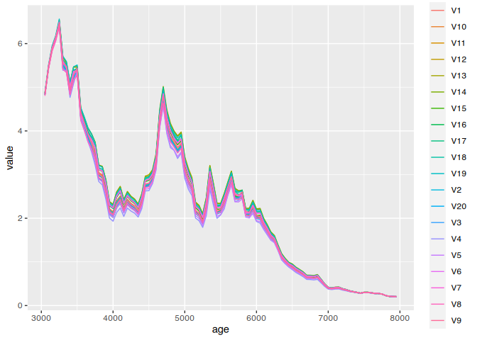
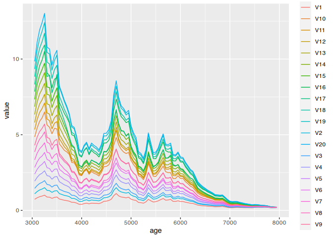

# Setup

Das Model hat 3 vorgegebene Parameter, deren Auswirkung wir in einer Sensititätsanalyse überprüfen wollen. Zuerst laden wir die notwendigen Bibliotheken.


```r
library(here)
```

```
## here() starts at /home/martin/r_projekte/bayesian.demographic.reconstruction.2022
```

```r
library(tidyverse)
```

```
## ── Attaching packages ─────────────────────────────────────── tidyverse 1.3.1 ──
```

```
## ✔ ggplot2 3.3.6     ✔ purrr   0.3.4
## ✔ tibble  3.1.7     ✔ dplyr   1.0.9
## ✔ tidyr   1.2.0     ✔ stringr 1.4.0
## ✔ readr   2.1.2     ✔ forcats 0.5.1
```

```
## ── Conflicts ────────────────────────────────────────── tidyverse_conflicts() ──
## ✖ dplyr::filter() masks stats::filter()
## ✖ dplyr::lag()    masks stats::lag()
```

```r
library(parallel)
library(doParallel)
```

```
## Lade nötiges Paket: foreach
```

```
## 
## Attache Paket: 'foreach'
```

```
## Die folgenden Objekte sind maskiert von 'package:purrr':
## 
##     accumulate, when
```

```
## Lade nötiges Paket: iterators
```

```r
library(nimble)
```

```
## nimble version 0.12.2 is loaded.
## For more information on NIMBLE and a User Manual,
## please visit https://R-nimble.org.
```

```
## 
## Attache Paket: 'nimble'
```

```
## Das folgende Objekt ist maskiert 'package:stats':
## 
##     simulate
```

```r
library(coda)
library(MCMCvis)
```

Dann erstellen wir die Grundbedingungen für den Modelldurchlauf. Dazu laden wir die Eingangsdaten und bereiten sie entsprechend des Modells auf (für Details zu diesen Schritten bitte konsultieren Sie die eigentliche Analyse):


```r
all_proxies <- read.csv(file = normalizePath(
  file.path(here(), "data","preprocessed_data", "all_proxies.csv")
  ),
  row.names = 1)
all_proxies <- all_proxies %>% arrange(desc(age))
all_proxies[,2:5] <- all_proxies[,2:5] %>% scale() %>% diff() %>% rbind(0,.)
model_data <- all_proxies
```

Als nächstes übernehmen wir das Modell, wobei wir alle potentiell sensitiven Parameter von Aussen zugänglich machen:


```r
model_code <- nimbleCode( {
  # ---- Process Model ----
  
  # Estimate the initial state vector of population abundances
  nEnd ~ dnorm(nSites[nYears] * MeanSiteSize / AreaSwissPlateau, sd=0.5)

  # Autoregressive process for remaining years
  for(t in 2:(nYears)) {
    # The actual number of sites per year
    nSites[t] ~ dpois(lambda[t])
    
    # limiting the change to a maximum value, estimated in the model
    constraint_lambda_lower[t] ~ dconstraint(
      nSites[t]/nSites[t-1] < (max_growth_rate + 1)
      )
    constraint_lambda_upper[t] ~ dconstraint(
      nSites[t-1]/nSites[t] < (max_growth_rate + 1)
      )
  }
  
  # ---- Observational Model ----

  # For all but the first year
  for(t in 2:(nYears)) {
    # lambda depends on the number of sites at the previous year, plus
    # changes in relation to the proxies
    log(lambda[t]) <- log(nSites[t-1]) + (
      p[1] * sumcal[t]  +
        p[2] * openness[t] +
        p[3] * aoristic_sum[t] + 
        p[4] * dendro[t]
      )
  }
  # ---- Priors ----
  # Relevance of the proxies is estimated as Dirichlet distribution
  p[1:4] ~ ddirch(alpha[1:4])
  
  # The parameters for the Dirichlet distribution have a weakly informative prior
  for(j in 1:4) {
    alpha[j] ~ dlnorm(mu_alpha[j],sdlog=a_alpha[j])
    a_alpha[j] ~ dexp(1)
    mu_alpha[j] ~ dlnorm(1,sdlog=0.1)
  }
  
  # The maximum growth rate has a prior gamma distributed between 0 and 1
  # by adding 1 in the process model, this becomes 1-2[
  max_growth_rate ~ dgamma(shape = 5, scale=0.05)

  # The mean site size
  MeanSiteSize ~ dpois(50)
    
  # ---- transformed data ----
  
  # Population density and total population as function of site number
  PopDens[1:(nYears)] <- PopTotal[1:(nYears)] / AreaSwissPlateau
  PopTotal[1:nYears] <- nSites[1:nYears] * MeanSiteSize
})
```

# Parameter Sweep

Wir werden jeweils 10 Parameterisierungen um unseren vorgeschlagenen Wert vornehmen. Dazu werden wir das Modell bis zur Konvergenz laufen lassen, und dann eine weitere Iteration mit der vorgesehenen Batch-Grösse durchführen. Anschliessend werden wir die Ergebnisse der einzelnen Durchläufe miteinander vergleichen.

Wir haben die Funktion zum Durchlauf des Modells ausgelagert, wir laden sie zuerst ein:


```r
source(file = normalizePath(file.path(here(), "code", "sensitivity_helpers.R")))
```


## Mean Site Size

Als erstes variieren wir die mean site size:


```r
mean_site_size_sweep <- seq(5,100,length.out = 20)

model_constants_df <- data.frame(
  nEnd = rep(5, length(mean_site_size_sweep)),
  nYears = rep(nrow(model_data), length(mean_site_size_sweep)),
  AreaSwissPlateau = rep(12649, length(mean_site_size_sweep)),
  ParamMeanSiteSize = mean_site_size_sweep
  )

model_constants_list <- purrr::transpose(model_constants_df)
```

Als nächstes können wir die eigentliche Analyse durchlaufen lassen und die Ergebnisse abspeichen. In der aktuellen Version ist dies deaktiviert, sie können es aber gerne anstellen, um es selbst durchlaufen zu lassen.


```r
sweep_results <- sweep_run(model_constants_list = model_constants_list,
                           this_model_data = model_data,
                           model_code = model_code)

saveRDS(sweep_results, file = normalizePath(
  file.path(here(), "data","preprocessed_data", "sensitivity_meansitesize.RDS"
            ),
  mustWork = F)
  )    
```

Und laden es wieder zurück (später ist das der Einsprungpunkt, um nicht die ganze Berechnung erneut durchführen zu müssen):


```r
sweep_results <- readRDS(file = normalizePath(
  file.path(here(), "data","preprocessed_data", "sensitivity_meansitesize.RDS"
            ))
  )
```

Jetzt können wir die Ergebnisse visualisieren. Wir werden die einzelnen Mittelwerte übereinander plotten:


```r
res_for_plot <- as.data.frame(sapply(sweep_results, function(x) x$mean))

res_for_plot$age <- model_data$age

res_for_plot <- pivot_longer(res_for_plot, !age)

ggplot(res_for_plot) + geom_line(aes(x = age, y = value, color = name))
```

<!-- -->

Die Vorgabe einer mittleren Siedlungsgrösse hat keinen starken erkennbaren Effekt auf das Ergebnis der Schätzung.

## Mean Site Size

Als nächstes überprüfen wir die Abhängigkeit von der vorgeschlagenen End-Populationsdichte.


```r
nEnd_sweep <- seq(0.5,10,length.out = 20)

model_constants_df <- data.frame(
  nEnd = nEnd_sweep,
  nYears = rep(nrow(model_data), length(nEnd_sweep)),
  AreaSwissPlateau = rep(12649, length(nEnd_sweep)),
  ParamMeanSiteSize = rep(50, length(nEnd_sweep))
  )

model_constants_list <- purrr::transpose(model_constants_df)
```

Auch hier ist der eigentliche Durchlauf aktuell deaktiviert, um das Rendering zu beschleunigen. Sie können es aber gern selbst durchführen.


```r
sweep_results <- sweep_run(model_constants_list = model_constants_list,
                           this_model_data = model_data,
                           model_code = model_code)

saveRDS(sweep_results, file = normalizePath(
  file.path(here(), "data","preprocessed_data", "sensitivity_nend.RDS"
            ),
  mustWork = F)
  )    
```

Und nun (vor allem, falls die Analyse nicht durchgelaufen ist), werden die Ergebnisse wieder einladen:


```r
sweep_results <- readRDS(file = normalizePath(
  file.path(here(), "data","preprocessed_data", "sensitivity_nend.RDS"
            ))
  )
```

Jetzt können wir die Ergebnisse visualisieren. Wir werden die einzelnen Mittelwerte übereinander plotten:


```r
res_for_plot <- as.data.frame(sapply(sweep_results, function(x) x$mean))

res_for_plot$age <- model_data$age

res_for_plot <- pivot_longer(res_for_plot, !age)

ggplot(res_for_plot) + geom_line(aes(x = age, y = value, color = name))
```

<!-- -->

Wie erwartet, hat dieser Parameter einen entscheidenden Einfluss auf das Ergebnis.
